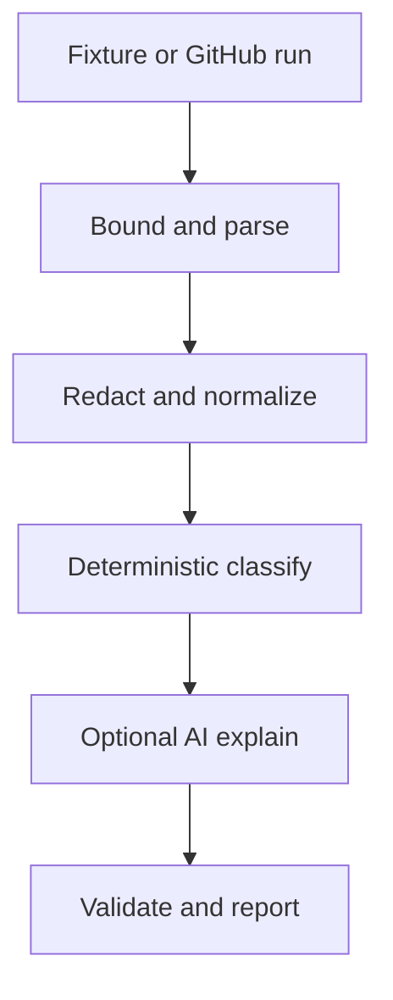

# Part 02: Architecture and Data Design

## Purpose

Design stable internal data contracts so acquisition, classification, AI explanation, and reporting can evolve independently.

## Study

Read the files in `architecture/`, then inspect `src/ci_triage/models.py`, `parser.py`, and `report.py`.

## Core flow

## Build tasks

1. Define a provider-neutral run record and evidence record.
2. Mark the workstation-to-GitHub and workstation-to-model trust boundaries.
3. Specify size, count, and character limits.
4. Define report fields and which component owns each field.
5. Record the decision that deterministic classification remains authoritative.
6. Threat-model secret leakage, prompt injection, path misuse, oversized input, and invented evidence.

## Validation

Trace one line from `sample-data/test-failure.json` to its evidence ID and final report. Confirm that every output conclusion has either explicit evidence or an explicit limitation.

## Completion gate

- [ ] Components and trust boundaries are diagrammed.
- [ ] Inputs are bounded before expensive processing.
- [ ] Provider data is normalized behind an internal contract.
- [ ] Report ownership and authority are unambiguous.

Next: [Part 03](../part-03-deterministic-baseline/README.md)

