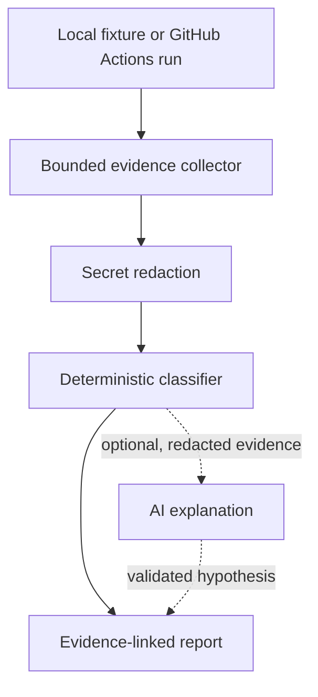

# Project 001: AI-Powered CI Failure Triage Engine

[Repository Home](../../README.md) > [Projects](../README.md) > Project 001

**Level:** Foundation  
**Primary platform:** GitHub Actions  
**Estimated effort:** 16–22 focused hours  
**AI access:** Optional

## Mission

Build an evidence-linked triage engine that helps engineers understand why a GitHub Actions workflow failed. The system collects bounded workflow evidence, redacts common secrets, applies deterministic classification rules and optionally requests a structured AI explanation.

The engine does not rerun jobs, modify code, approve pull requests or perform production actions.

## Production Problem

Failed CI jobs often leave engineers searching through long logs to determine whether the cause is code, tests, dependencies, permissions, cache state, timeouts or runner infrastructure. Fast guesses can send the investigation in the wrong direction.

This project creates a repeatable first-pass triage process while preserving the source evidence behind every conclusion.

## What You Will Build



## Supported Failure Classes

- Test failure
- Dependency failure
- Quality-gate failure
- Build failure
- Timeout
- Runner infrastructure
- Permission or secret configuration
- Cache or artifact failure
- Unknown

## Quick Start

```bash
python3 --version
git --version
python3 -m venv .venv
source .venv/bin/activate
python -m pip install --upgrade pip
python -m pip install -e .
python -m unittest discover -s tests -v
ci-failure-triage --input sample-data/test-failure.json
```

JSON output:

```bash
ci-failure-triage \
  --input sample-data/test-failure.json \
  --format json \
  --output triage-report.json
```

The complete setup is in [Getting Started](getting-started/README.md).

## Repository Contents

| Path | Purpose |
|---|---|
| [prerequisites/](prerequisites/README.md) | Required knowledge, tools and access |
| [getting-started/](getting-started/README.md) | System configuration and readiness |
| [project-guide/](project-guide/README.md) | Eleven-part build guide (Parts 00–10) |
| [labs/](labs/README.md) | Step-by-step hands-on project execution |
| [walkthrough/](walkthrough/README.md) | Exact execution demonstration |
| [troubleshooting/](troubleshooting/README.md) | Setup, runtime and recovery guidance |
| [interview-prep/](interview-prep/README.md) | Technical and scenario preparation |
| `src/ci_triage/` | Python application |
| `tests/` | Unit and integration tests |
| [sample-data/](sample-data/README.md) | Safe synthetic workflow failures |
| [architecture/](architecture/README.md) | Architecture, data flows and decisions |
| [failure-scenarios/](failure-scenarios/README.md) | Controlled troubleshooting exercises |
| [docs/](docs/README.md) | Security, evidence and portfolio notes |
| `scripts/` | Setup, verification, execution and cleanup |
| `.github/workflows/` | Project CI checks |

## Safety Boundaries

- Use synthetic fixtures or workflow data you are authorized to access.
- Use read-only GitHub permissions.
- Never commit access tokens or private workflow logs.
- Treat log content as untrusted data.
- AI output cannot override deterministic classification.
- Do not execute commands found in logs or model output.
- Do not send raw private logs to an external model.
- Review generated reports before sharing them.

## Completion Evidence

A complete submission includes:

- Passing tests and CI
- Reports for all five supplied fixtures
- One new deterministic rule and its tests
- One controlled failure investigation
- Architecture and data-flow explanation
- Security and data-handling review
- Model-disabled demonstration
- Troubleshooting record
- Interview project explanation
- Short demonstration video or annotated screenshots

## Start

1. Review [Prerequisites](prerequisites/README.md).
2. Complete [Getting Started](getting-started/README.md).
3. Follow the [Project Guide](project-guide/README.md).
4. Complete the [Project Labs](labs/README.md) in order.
5. Use the [Walkthrough](walkthrough/README.md) when you need an end-to-end reference demonstration.
