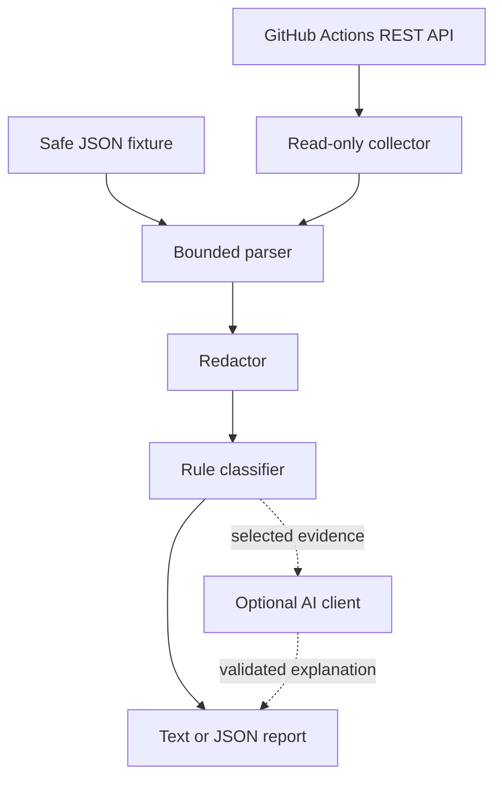

# System Architecture

The CLI coordinates all components. The parser enforces input limits. The classifier decides the primary category. The optional AI client explains that decision but cannot replace it.

